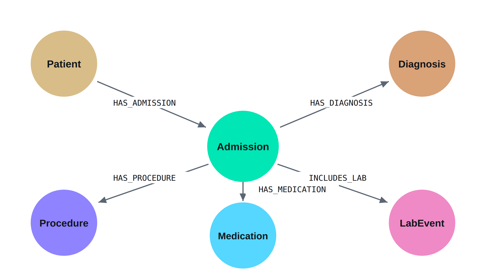

# Graph Backend

Neo4j patient-journey graph over MIMIC-IV, with a routed retrieval pipeline on top of it.

```
33,980 nodes · 45,226 relationships
100 patients · 275 admissions
31,183 lab events · 1,472 diagnoses · 598 medications · 352 procedures
```



MIMIC-IV Clinical Database Demo v2.2, openly licensed (ODC-BY 1.0) — no credentialing required to reproduce. For comparison, MediGRAF (Thio et al., *Frontiers in Digital Health*, 2026) reports 5,973 nodes and 5,963 relationships over ten patients.

## Files

| File | Contents |
|---|---|
| `technical_walkthrough.md` | Graph construction, schema, query language, backend pipeline, and every Cypher query executed |
| `hybridisation_summary.md` | One page: the two-path routed architecture and why it replaces score fusion |
| `pipeline.py` | Router → Text2Cypher → validator → Neo4j → synthesis |
| `queries.cypher` | The six presentation queries, in order, with notes |
| `neo4j_favourites_foldered.csv` | Bulk import of those queries into Neo4j Browser's Favorites |
| `neo4j_favourites.csv` | Same, without the folder |
| `figures/` | The three paper figures, with captions and the schema table |

## Where each thing is documented

| | |
|---|---|
| How the graph is built | `technical_walkthrough` §1 — connection, constraints, source CSVs, load order, verified counts |
| Schema | §2 — six node labels, five relationship types, and the two design decisions behind them |
| Query language | §3 — Cypher, the router, and Text2Cypher with its guardrails |
| Backend pipeline | §4 — the five stages, the read-only validation boundary, and the fallback path |
| Cypher queries executed | §5 — organised in five tiers by the reasoning each requires, including a query that deliberately returns nothing |
| Hybridisation | `hybridisation_summary` |

## Architecture

Two retrieval paths that fail in non-overlapping ways, **routed by question type rather than fused by score**.

- **Path A — structured.** Text2Cypher over Neo4j. Answers *what, when, how many, in what order*. Exact, complete, and auditable: the query is a written artifact a clinician can read and verify.
- **Path B — narrative.** Dense vector search over clinical notes. Answers *why, what was considered, what was ruled out*.

Routing happens before Cypher is generated, because Text2Cypher does not refuse — given an unanswerable question it produces plausible Cypher returning related-but-irrelevant rows, and an answer built from those reads as responsive while being unfounded.

## Reproducing

1. Download MIMIC-IV Demo v2.2 from [PhysioNet](https://physionet.org/content/mimic-iv-demo/) — open access, no credentialing.
2. Create a free Neo4j AuraDB instance.
3. Run the notebook. The graph rebuilds in roughly eight minutes.

Credentials are entered at runtime via `getpass` and are never written to disk or committed.

## Status

Path A is implemented and demonstrated end to end on the open demo release. Path B requires MIMIC-IV-Note, which is not in the demo; PhysioNet credentialing is now granted, so it is buildable on the credentialed release.

PhysioNet permits credentialed data to be processed through providers that do not retain prompts, train on them, or subject them to routine human review, and names Anthropic among them ([guidance](https://physionet.org/news/post/gpt-responsible-use)). The pipeline in this repository therefore needs no change to run on the credentialed data.

Routing is an implemented architecture, not yet a measured result. The experiment it enables — routing versus context concatenation, scored on simple and medium query tiers — is the next step.

**Everything in this repository uses the open demo release only.** No credentialed MIMIC-IV data, and no output derived from it, is committed here.
