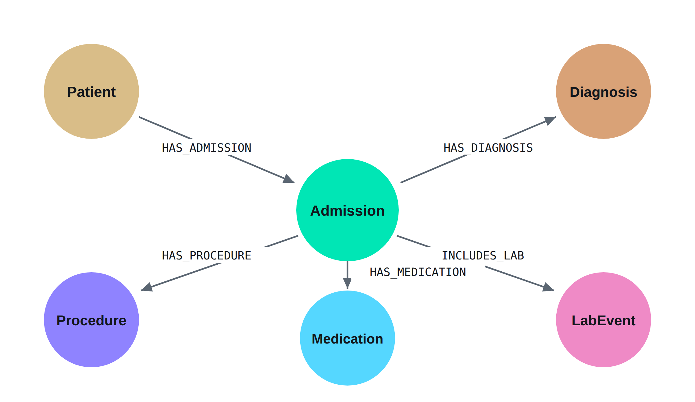

# Graph Backend

Neo4j patient-journey graph over MIMIC-IV, with a routed retrieval pipeline on top of it.

```
33,980 nodes · 45,226 relationships
100 patients · 275 admissions
31,183 lab events · 1,472 diagnoses · 598 medications · 352 procedures
```



MIMIC-IV Clinical Database Demo v2.2, openly licensed (ODC-BY 1.0) — no credentialing required to reproduce. For comparison, MediGRAF (Thio et al., *Frontiers in Digital Health*, 2026) reports 5,973 nodes and 5,963 relationships over ten patients.

## Files

| File | Contents |
|---|---|
| `results.md` | **Measured results** — Text2Cypher accuracy under two scoring criteria, failures, the schema ablation, routing versus concatenation, and limitations |
| `technical_walkthrough.md` | Graph construction, schema, query language, backend pipeline, and every Cypher query executed |
| `hybridisation_summary.md` | One page: the two-path routed architecture and what the evidence does and does not support |
| `pipeline.py` | Router → Text2Cypher → validator → Neo4j → synthesis |
| `evaluation.py` | 44-question bank with reference queries, and the dual-criterion scoring harness |
| `experiment.py` | Routing versus context concatenation, scored by value recall |
| `queries.cypher` | The six presentation queries, in order, with notes |
| `pathb.py` | Loads the note index and defines `search()` |
| `pathb_eval.py` | Retrieval evaluation for Path B (optional) |
| `notebooks/01_build_graph.ipynb` | Builds the graph from the demo release. Run this first. |
| `notebooks/02_pipeline_and_evaluation.ipynb` | Path A, Path B, the evaluation and the experiment |
| `figures/` | The three paper figures, with captions and the schema table |

## Where each thing is documented

| | |
|---|---|
| How the graph is built | `technical_walkthrough` §1 — connection, constraints, source CSVs, load order, verified counts |
| Schema | §2 — six node labels, five relationship types, and the two design decisions behind them |
| Query language | §3 — Cypher, the router, and Text2Cypher with its guardrails |
| Backend pipeline | §4 — the five stages, the read-only validation boundary, and the fallback path |
| Cypher queries executed | §5 — organised in five tiers by the reasoning each requires, including a query that deliberately returns nothing |
| Hybridisation | `hybridisation_summary` |
| Measured results | `results.md` — accuracy tables, failures, ablation, and what the evidence does not support |

## Architecture

Two retrieval paths that fail in non-overlapping ways, **routed by question type rather than fused by score**.

- **Path A — structured.** Text2Cypher over Neo4j. Answers *what, when, how many, in what order*. Exact, complete, and auditable: the query is a written artifact a clinician can read and verify.
- **Path B — narrative.** Dense vector search over clinical notes. Answers *why, what was considered, what was ruled out*.

Routing happens before Cypher is generated, because Text2Cypher does not refuse — given an unanswerable question it produces plausible Cypher returning related-but-irrelevant rows, and an answer built from those reads as responsive while being unfounded.

## Reproducing

Path A needs no credentialed data. Everything below runs from the open demo
release.

1. Create a free Neo4j AuraDB instance at [console.neo4j.io](https://console.neo4j.io).
2. Run **`notebooks/01_build_graph.ipynb`**. It downloads MIMIC-IV Demo v2.2
   from PhysioNet (open access, no login), loads the graph in about eight
   minutes, and verifies 33,980 nodes and 45,226 relationships. Stop if those
   counts do not match.
3. Open **`notebooks/02_pipeline_and_evaluation.ipynb`** and upload
   `pipeline.py`, `evaluation.py` and `experiment.py` into the session. §1–§3
   are Path A and its evaluation.

Path B additionally requires PhysioNet credentialing for MIMIC-IV-Note, with
BigQuery access granted to your Google account, and a GCP project. Notebook 02
§4 onward covers it. Embeddings are computed locally, so note text stays in the
execution environment.

Credentials are entered at runtime and never written to disk or committed.

## Results

Both paths are built and measured. Full tables, failure analysis and limitations
are in [`results.md`](results.md).

**Path A — Text2Cypher.** 44 questions in five tiers, five runs at temperature 0.

| Tier | n | strict | projection |
|---|---:|---|---|
| simple | 12 | 91.7% (92–92) | 100.0% (100–100) |
| medium | 12 | 25.0% (25–25) | 91.7% (92–92) |
| hard | 10 | 38.0% (30–40) | 86.0% (80–90) |

The two criteria differ by 67 points on the medium tier over identical model
outputs, both with zero range. *Strict* requires an exact value multiset;
*projection* allows extra columns. MediGRAF reports 51.6% on this tier without
stating a criterion, so the figures are not comparable — that is reported as a
finding, not worked around.

**Path B — note retrieval.** 243 discharge summaries covering 100/100 patients
and 243/275 admissions (88%; the remainder are observation stays, which
generate no discharge summary). Embeddings are computed locally, so
credentialed text never leaves the execution environment.

**Routing versus concatenation — not supported.** Identical mean value recall
(0.744, n = 32). Re-running the routing arm unchanged differed from itself by
0.244 per question against 0.098 between arms, so the difference between
architectures sits below the synthesis step's own variance. No effect is
detectable at this sample size.

What routing is defended on instead is **auditability**: a generated Cypher
query is a written artifact a clinician can read and confirm asked the right
question, and a similarity score is not. The M05 failure is the concrete case —
a query that runs clean and returns ten times too many rows, caught by reading
it and by nothing else.

## Status

Path A and Path B are both implemented and measured on 100 patients. Two Path A
failures remain open (documented in `results.md` §3.4), and the schema-prompt
fix for one of them is shown to cost more than it gains.

MIMIC-IV-Note is credentialed; access here is through PhysioNet's BigQuery
route, scoped to the demo cohort.

**Everything in this repository uses the open demo release only.** No
credentialed MIMIC-IV data, and no output derived from it, is committed here.
Saved run files contain question ids, generated Cypher and scores — no patient
data.
