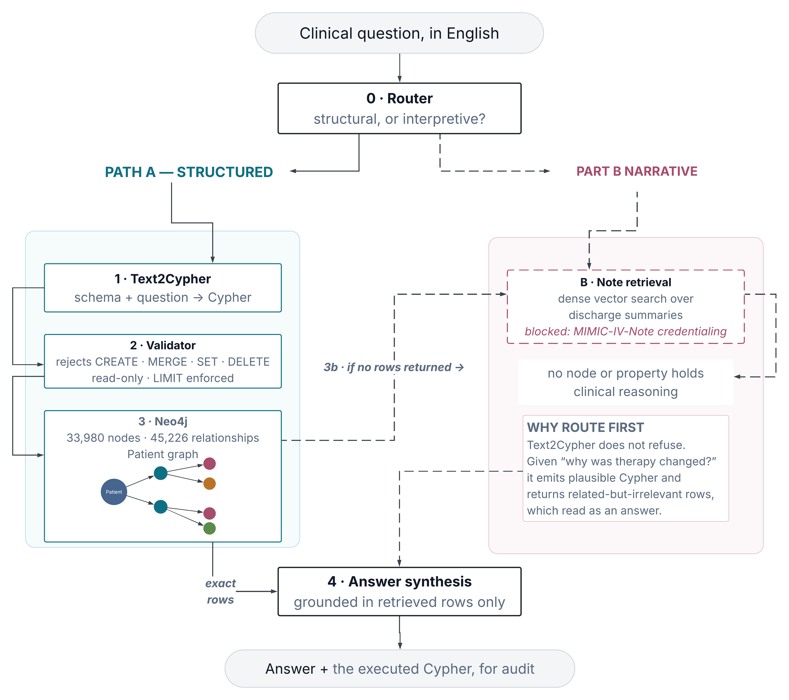
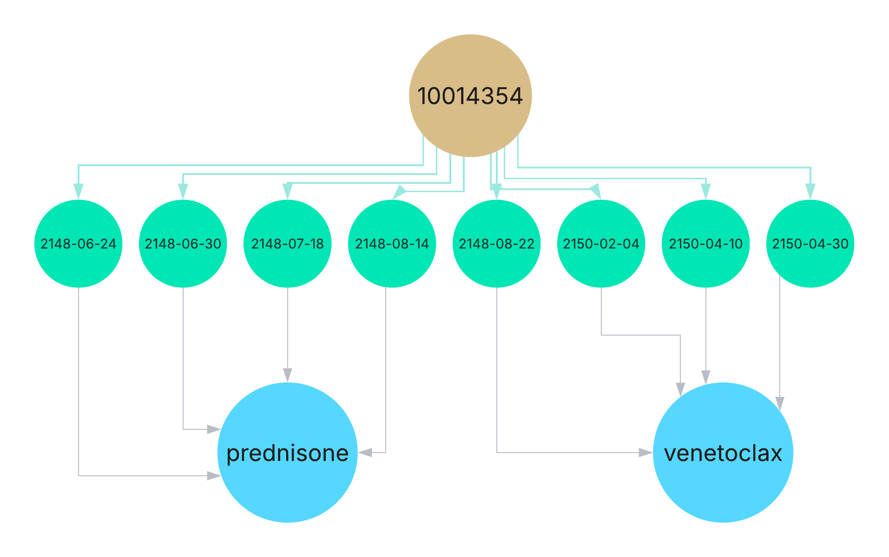

# Graph Backend — Technical Walkthrough

**Harshit Kapur** · MSc Computer Science, Lakehead University<br>
Supervisors: Dr. Sabah Mohammed, Dr. Jinan Fiaidhi

Neo4j patient-journey graph over MIMIC-IV Clinical Database Demo v2.2 (openly licensed, ODC-BY 1.0).<br>
Covers: graph construction, schema, backend pipeline, query language, and the Cypher queries executed.

---

## 1. How the graph starts

### 1.1 Database

Neo4j AuraDB Free — a hosted Neo4j 5.x instance. No local installation, no Docker, accessible over the encrypted Bolt protocol from anywhere.

Connection (credentials supplied at runtime, never committed):

```python
from neo4j import GraphDatabase
from google.colab import userdata

URI  = "neo4j+s://<instance-id>.databases.neo4j.io"
USER = "<instance-id>"          # AuraDB uses the instance ID, not "neo4j"
PWD  = userdata.get("NEO4J_PWD")
DB   = "<instance-id>"

driver = GraphDatabase.driver(URI, auth=(USER, PWD))
driver.verify_connectivity()
```

A batching helper keeps write transactions under AuraDB Free's memory limit:

```python
def run(q, rows=None, batch=500):
    """Execute a Cypher statement. If rows are supplied, UNWIND them in batches."""
    with driver.session(database=DB) as s:
        if rows is None:
            s.run(q)
            return
        for i in range(0, len(rows), batch):
            s.run(q, rows=rows[i:i+batch])
```

### 1.2 Constraints and indexes — before any data is loaded

Uniqueness constraints enforce identity and create the backing indexes that make `MERGE` and `MATCH` fast. Without these, every `MERGE` is a full label scan and load time grows quadratically.

```cypher
CREATE CONSTRAINT patient_id IF NOT EXISTS
FOR (p:Patient)    REQUIRE p.subject_id IS UNIQUE;

CREATE CONSTRAINT adm_id IF NOT EXISTS
FOR (a:Admission)  REQUIRE a.hadm_id IS UNIQUE;

CREATE CONSTRAINT dx_code IF NOT EXISTS
FOR (d:Diagnosis)  REQUIRE d.icd_code IS UNIQUE;

CREATE CONSTRAINT med_name IF NOT EXISTS
FOR (m:Medication) REQUIRE m.name IS UNIQUE;

CREATE CONSTRAINT IF NOT EXISTS
FOR (p:Procedure)  REQUIRE p.icd_code IS UNIQUE;

CREATE INDEX IF NOT EXISTS FOR (l:LabEvent) ON (l.label);
```

`LabEvent` gets an index rather than a constraint. A patient legitimately has many creatinine measurements and each is a distinct event node, so uniqueness would be wrong — but almost every lab query filters on `label`, so the index earns its keep.

### 1.3 Source data

MIMIC-IV Demo v2.2 CSVs, loaded with pandas:

| File | Contents |
|---|---|
| `hosp/patients.csv.gz` | 100 de-identified patients: anchor age, gender |
| `hosp/admissions.csv.gz` | 275 hospital admissions: admit/discharge time, type |
| `hosp/diagnoses_icd.csv.gz` | ICD-9/10 diagnosis codes per admission |
| `hosp/d_icd_diagnoses.csv.gz` | Code → human-readable long title |
| `hosp/procedures_icd.csv.gz` | ICD procedure codes per admission |
| `hosp/d_icd_procedures.csv.gz` | Procedure code → long title |
| `hosp/prescriptions.csv.gz` | Drug, route, dose, start time per admission |
| `hosp/labevents.csv.gz` | Lab measurements with numeric values and units |
| `hosp/d_labitems.csv.gz` | Lab item ID → label |

### 1.4 Load order

Order matters: a relationship cannot be created before both endpoints exist. Patients first, then admissions attached to patients, then everything attached to admissions.

**Patients**

```cypher
UNWIND $rows AS r
MERGE (p:Patient {subject_id: r.subject_id})
SET p.gender = r.gender,
    p.anchor_age = r.anchor_age,
    p.anchor_year = r.anchor_year
```

**Admissions**

```cypher
UNWIND $rows AS r
MATCH (p:Patient {subject_id: r.subject_id})
MERGE (a:Admission {hadm_id: r.hadm_id})
SET a.admission_type     = r.admission_type,
    a.admittime          = r.admittime,
    a.dischtime          = r.dischtime,
    a.discharge_location = r.discharge_location
MERGE (p)-[:HAS_ADMISSION]->(a)
```

**Diagnoses** — ICD codes joined to their long titles before loading, so the graph carries readable text. Codes with no entry in the dictionary fall back to the bare code rather than becoming null:

```python
dx2 = dx.merge(ddx, on=['icd_code','icd_version'], how='left')
dx2['long_title'] = dx2.long_title.fillna(dx2.icd_code)
```

```cypher
UNWIND $rows AS r
MATCH (a:Admission {hadm_id: r.hadm_id})
MERGE (d:Diagnosis {icd_code: r.icd_code})
SET d.long_title = r.long_title, d.icd_version = r.icd_version
MERGE (a)-[:HAS_DIAGNOSIS {seq_num: r.seq_num}]->(d)
```

`seq_num` is the diagnosis ordering within the admission — sequence 1 is the principal diagnosis. It sits on the relationship because the ranking belongs to *that admission's* coding, not to the diagnosis itself.

**Procedures** — same shape as diagnoses, with the date the procedure was charted carried on the relationship:

```cypher
UNWIND $rows AS r
MATCH (a:Admission {hadm_id: r.hadm_id})
MERGE (p:Procedure {icd_code: r.icd_code})
SET p.long_title = r.long_title
MERGE (a)-[:HAS_PROCEDURE {chartdate: r.chartdate}]->(p)
```

**Medications** — drug names are lowercased and stripped first, so the same drug written differently on two orders becomes one node. Pandas `NaN` is then converted to `None`:

```python
rx2 = rx.dropna(subset=['drug','hadm_id']).copy()
rx2['drug'] = rx2.drug.str.lower().str.strip()
rx2 = rx2.astype(object).where(rx2.notna(), None)
```

```cypher
UNWIND $rows AS r
MATCH (a:Admission {hadm_id: r.hadm_id})
MERGE (m:Medication {name: r.drug})
MERGE (a)-[h:HAS_MEDICATION]->(m)
SET h.route     = r.route,
    h.dose      = r.dose_val_rx,
    h.unit      = r.dose_unit_rx,
    h.starttime = r.starttime
```

This shape was arrived at by hitting both of its failure modes in turn, and both are worth recording because the obvious formulation fails.

Writing the properties inside the `MERGE` — `MERGE (a)-[:HAS_MEDICATION {dose: r.dose_val_rx, ...}]->(m)` — fails on the raw dataframe with:

```
Neo.ClientError.Statement.SemanticError: Cannot merge the following relationship
because of NaN property value for 'dose':
(a)-[:HAS_MEDICATION {dose: NaN}]->(m)
```

Many prescriptions have no recorded dose, and pandas represents that as `NaN`, which Neo4j will not accept in a merge key. Converting `NaN` to `None` removes that error and produces the next one — `MERGE` will not search on a null property either. The fix is to take the properties out of the merge key entirely: `MERGE` establishes the relationship on `(admission, drug)` alone, and `SET` applies the prescription details afterwards, where missing values are harmless.

One consequence to be aware of when reading the counts: because the relationship is keyed on admission and drug only, repeat orders of the same drug within one admission collapse into a single relationship carrying the last-written values. The 8,540 `HAS_MEDICATION` relationships are therefore distinct admission-drug pairs, not individual prescription events.

**Lab events** — filtered to flagged-abnormal results only:

```python
lab2 = lab[lab.flag == 'abnormal'].dropna(subset=['hadm_id']).merge(
           dlab[['itemid','label']], on='itemid', how='left')
```

```cypher
UNWIND $rows AS r
MATCH (a:Admission {hadm_id: r.hadm_id})
CREATE (l:LabEvent {label: r.label, value: r.value, valuenum: r.valuenum,
                    valueuom: r.valueuom, flag: r.flag, charttime: r.charttime})
MERGE (a)-[:INCLUDES_LAB]->(l)
```

`CREATE` rather than `MERGE`, because each measurement is a distinct event. This is also why the loader must not be re-run against a populated database: `CREATE` is not idempotent and a second pass duplicates every lab node. The cell therefore asserts the label is empty before loading.

**The abnormal-only filter is a substantive limitation, not a detail.** All 31,183 `LabEvent` nodes carry `flag = 'abnormal'`; normal results were never loaded. So a query for peak creatinine returns the peak *flagged-abnormal* creatinine, and a patient whose values were all within range has no lab nodes at all. The filter keeps the graph tractable on a free-tier instance and keeps the clinically salient values, but any claim about a patient's lab history has to be read as a claim about their abnormal lab history. Removing the filter is a one-line change if a later evaluation needs the full series.

### 1.5 Resulting graph

**33,980 nodes · 45,226 relationships.** Counts read back from the live database after a single clean load:

| Node label | Count | | Relationship type | Count |
|---|---:|---|---|---:|
| LabEvent | 31,183 | | INCLUDES_LAB | 31,183 |
| Diagnosis | 1,472 | | HAS_MEDICATION | 8,540 |
| Medication | 598 | | HAS_DIAGNOSIS | 4,506 |
| Procedure | 352 | | HAS_PROCEDURE | 722 |
| Admission | 275 | | HAS_ADMISSION | 275 |
| Patient | 100 | | | |
| **Total** | **33,980** | | **Total** | **45,226** |

Three of these confirm the load behaved as designed:

- `HAS_ADMISSION` (275) equals the Admission count exactly — every admission belongs to one patient, with no orphans or duplicates.
- `INCLUDES_LAB` (31,183) equals the LabEvent count exactly — each measurement attaches to a single admission.
- 8,540 `HAS_MEDICATION` relationships run to only 598 Medication nodes — each drug node is shared across roughly fourteen admissions. This is the property-graph payoff: the drug is stored once, and dose, route and start time ride on the relationship because they belong to *that admission's* use of it.

**A caution about the second check.** `INCLUDES_LAB` matching `LabEvent` proves each lab node has exactly one admission edge — it does **not** prove the labs were loaded once. Re-running the lab cell duplicates node and relationship together, so the identity holds at 31,183, at 62,366 and at 93,549 alike. An earlier version of this graph carried 62,366 lab events for precisely that reason, and the check did not catch it. The reliable test is that a single clean load reproduces the table above; the loader now asserts `LabEvent` is empty before running.

For comparison, MediGRAF (Thio et al., *Frontiers in Digital Health*, 2026) reports 5,973 nodes and 5,963 relationships over ten patients, with 89 embedded documents (25 discharge summaries, 64 radiology reports) — roughly six times smaller, over a tenth of the patients.

---

## 2. Schema

```
(:Patient {subject_id, gender, anchor_age, anchor_year})
   │
   └─[:HAS_ADMISSION]─▶ (:Admission {hadm_id, admission_type, admittime,
        │                            dischtime, discharge_location})
        │
        ├─[:HAS_DIAGNOSIS {seq_num}]─▶ (:Diagnosis {icd_code, long_title,
        │                                           icd_version})
        │
        ├─[:HAS_PROCEDURE {chartdate}]─▶ (:Procedure {icd_code, long_title})
        │
        ├─[:HAS_MEDICATION {route, dose, unit, starttime}]─▶
        │                                (:Medication {name})
        │
        └─[:INCLUDES_LAB]─▶ (:LabEvent {label, value, valuenum,
                                        valueuom, flag, charttime})
```

Every `LabEvent` carries `flag = 'abnormal'` — see §1.4. Three design decisions worth stating:

**Medication dose lives on the relationship, not the node.** `Medication {name: "venetoclax"}` is one node shared across every admission that used it. The dose, route and start time are specific to *that admission's* use of it, so they belong on the edge. This is what a property graph offers over a relational schema: the relationship itself carries data.

**Admission is the hub.** Every clinical fact attaches to an admission rather than directly to a patient, which is what makes longitudinal queries possible — the graph knows not just *that* a patient had a diagnosis, but *when*, relative to every other event.

**Two relationships are keyed by their properties, one is not.** `seq_num` on `HAS_DIAGNOSIS` and `chartdate` on `HAS_PROCEDURE` sit inside their `MERGE`, so each distinct combination produces its own edge — a diagnosis coded at sequence 1 on one admission and sequence 4 on another is two edges to the same node. `HAS_MEDICATION` could not be built that way, for the reason given in §1.4, so it is keyed on admission and drug alone with the prescription details applied by `SET`. Read its count accordingly: 8,540 admission-drug pairs, not 8,540 prescription events.

---

## 3. The query language — Cypher

Cypher is Neo4j's declarative query language. It describes graph patterns using ASCII art: `()` is a node, `-[]->` is a directed relationship.

```cypher
MATCH (p:Patient)-[:HAS_ADMISSION]->(a:Admission)-[:HAS_DIAGNOSIS]->(d:Diagnosis)
WHERE d.long_title CONTAINS 'leukemia'
RETURN p.subject_id, count(DISTINCT a) AS admissions
ORDER BY admissions DESC
```

Read literally: *find patients who had admissions that carried a leukaemia diagnosis; count their distinct admissions; sort descending.*

### Why this matters for the retrieval argument

Three properties that vector search does not have:

1. **Multi-hop traversal is one clause.** Patient → admission → diagnosis is a single pattern. In SQL it is two joins; in vector search it is not expressible at all.
2. **Aggregation is exact.** `count`, `max`, `collect` operate on the actual data. A retrieval system that returns the five most similar passages cannot tell you there were exactly twenty admissions.
3. **The query is an auditable artifact.** A clinician can read the Cypher and verify it asked the right question. A similarity score cannot be inspected this way — and in a clinical setting, that is the difference between a reviewable system and an opaque one.

### Text2Cypher — natural language to Cypher

The user does not write Cypher. An LLM translates the question, given the schema:

```python
SCHEMA = """
(:Patient {subject_id, gender, anchor_age})-[:HAS_ADMISSION]->
(:Admission {hadm_id, admittime, dischtime, admission_type})
(:Admission)-[:HAS_DIAGNOSIS]->(:Diagnosis {icd_code, long_title})
(:Admission)-[:HAS_MEDICATION {route, dose, unit, starttime}]->(:Medication {name})
(:Admission)-[:INCLUDES_LAB]->(:LabEvent {label, valuenum, valueuom, charttime})
"""

def text2cypher(question, sid=None):
    prompt = f"""You translate clinical questions into Neo4j Cypher.
{SCHEMA}
Question: {question}
{f"Scope to patient subject_id = {sid}." if sid else ""}
Return ONLY the Cypher query. No explanation, no markdown fences.
Always LIMIT results to at most 50 rows."""
    r = client.messages.create(
        model="claude-opus-5", max_tokens=600,
        messages=[{"role": "user", "content": prompt}])
    q = next(b.text for b in r.content if b.type == "text").strip()
    return re.sub(r'^```(?:cypher)?|```$', '', q, flags=re.M).strip()
```

### The router — which path a question takes

Text2Cypher runs only after a question has been classified, because it cannot decline. A separate call decides the path first:

```python
def route(question):
    prompt = f"""You route clinical questions to one of two retrieval paths.

STRUCTURED — answerable from recorded fields: admissions, diagnoses, procedures,
  medication records, lab values. Questions of what, when, how many, in what order.
NARRATIVE — requires clinical reasoning, justification, or differential thinking
  recorded only in free-text notes. Questions of why, what was considered,
  what was ruled out.

Question: {question}

Reply with exactly one word: STRUCTURED or NARRATIVE."""
    r = client.messages.create(model="claude-opus-5", max_tokens=10,
            messages=[{"role": "user", "content": prompt}])
    return next(b.text for b in r.content if b.type == "text").strip().upper()
```

Three guardrails are built into the Cypher generation itself:

- **The schema is supplied in full**, so the model generates against the actual labels rather than guessing plausible ones.
- **Patient scoping** is injected as a parameter rather than left to the model, which prevents queries leaking across patients.
- **A mandatory `LIMIT`** bounds result size — a generated query that matches the whole graph cannot exhaust the connection.

Worked example:

> **Question:** "Which medications did patient 10014354 receive during the admission where creatinine was highest?"

Generated Cypher:

```cypher
MATCH (p:Patient {subject_id: 10014354})-[:HAS_ADMISSION]->(a:Admission)
MATCH (a)-[:INCLUDES_LAB]->(l:LabEvent)
WHERE l.label CONTAINS 'Creatinine'
WITH a, max(l.valuenum) AS peak
ORDER BY peak DESC LIMIT 1
MATCH (a)-[:HAS_MEDICATION]->(m:Medication)
RETURN a.admittime AS admitted, peak, collect(DISTINCT m.name) AS medications
LIMIT 50
```

---

## 4. Backend pipeline

```
  Natural-language clinical question
                │
                ▼
  ┌─────────────────────────────┐
  │  0. Router (LLM)            │   structural or interpretive?
  └─────────────────────────────┘
          │                │
     STRUCTURED        NARRATIVE ─────────────┐
          │                                   │
          ▼                                   │
  ┌─────────────────────────────┐             │
  │  1. Text2Cypher (LLM)       │   schema +  │
  │     → Cypher string         │   question  │
  └─────────────────────────────┘             │
                │
                ▼
  ┌─────────────────────────────┐
  │  2. Validation              │   read-only check, LIMIT enforced,
  │                             │   patient scope confirmed
  └─────────────────────────────┘
                │
                ▼
  ┌─────────────────────────────┐
  │  3. Neo4j execution         │   driver.session(database=DB).run(q)
  │     → structured rows       │
  └─────────────────────────────┘
                │
        ┌───────┴────────┐
        │                │                  │
   rows returned    empty / error            │
        │                │                   │
        │                ▼                   ▼
        │     ┌─────────────────────────────────┐
        │     │  3b / B. Dense note retrieval   │   vector search over
        │     │                                 │   clinical-note embeddings
        │     └─────────────────────────────────┘
        │                │
        └───────┬────────┘
                ▼
  ┌─────────────────────────────┐
  │  4. Answer synthesis (LLM)  │   rows + retrieved notes → grounded answer
  │     with the Cypher shown   │   alongside, for audit
  └─────────────────────────────┘
```

**Step 2 is a safety boundary, not a formality.** Generated Cypher is untrusted input. The validator rejects any statement containing `CREATE`, `MERGE`, `SET`, `DELETE`, `DETACH`, `DROP` or `CALL db.` — the graph is read-only at query time. It also confirms a `LIMIT` is present and that the patient scope was not dropped.

**Step 0 and Step 3b are where the hybridisation lives.** A question of *why* — *"why was therapy changed?"* — has no structural mapping: no node or property holds clinical reasoning. The router sends it to the narrative path before any Cypher is generated, because Text2Cypher does not refuse. Given an unanswerable question it produces plausible Cypher that returns related-but-irrelevant rows, and an answer synthesised from those rows reads as responsive while being unfounded. Routing first prevents that. Step 3b then catches the remaining case: a structural question whose query legitimately returns nothing.

This is where the design departs from MediGRAF. Thio et al. run both paths simultaneously and merge the results by context concatenation, with no routing step — *"the hybrid engine orchestrates the full retrieval and generation process via a four-step pipeline: 1. Structured Retrieval… 2. Unstructured Retrieval: Simultaneously, the system performs a vector similarity search… 3. Context Consolidation: The results are merged via context concatenation."* Concatenation is the same fusion strategy that produced no measurable gain in the MedQA benchmark (96.2% vs 96.0%, p = 0.72), and it dilutes an exact structured answer with approximate passages whenever the question was structural to begin with.

**Step 4 shows the query.** The synthesised answer is returned with the executed Cypher attached. The user can see exactly what was asked of the database.

---

## 5. Cypher queries executed

Organised by the reasoning each one requires. All were run against the live graph; outputs are real.

### Tier 1 — Single hop: what is recorded

```cypher
// Q1. Cohort size
MATCH (p:Patient) RETURN count(p) AS patients;
// → 100

// Q2. Graph scale
MATCH (n) RETURN count(n) AS nodes;
MATCH ()-[r]->() RETURN count(r) AS relationships;
// → 33,980 nodes / 45,226 relationships

// Q3. Most frequent diagnoses across the cohort
MATCH (:Admission)-[:HAS_DIAGNOSIS]->(d:Diagnosis)
RETURN d.long_title AS diagnosis, count(*) AS n
ORDER BY n DESC LIMIT 10;
```

### Tier 2 — Two hops: linking a patient to clinical facts

```cypher
// Q4. Every admission for one patient, with diagnosis count
MATCH (p:Patient {subject_id: 10014354})-[:HAS_ADMISSION]->(a:Admission)
OPTIONAL MATCH (a)-[:HAS_DIAGNOSIS]->(d:Diagnosis)
RETURN a.hadm_id      AS admission,
       a.admittime    AS admitted,
       count(DISTINCT d) AS diagnoses
ORDER BY admitted;
// → 20 admissions
```

```cypher
// Q5. Patients carrying a leukaemia diagnosis, ranked by admission count
MATCH (p:Patient)-[:HAS_ADMISSION]->(a:Admission)-[:HAS_DIAGNOSIS]->(d:Diagnosis)
WHERE toLower(d.long_title) CONTAINS 'lymphocytic leukemia'
RETURN p.subject_id AS patient, count(DISTINCT a) AS admissions
ORDER BY admissions DESC;
```

### Tier 3 — Aggregation: questions retrieval cannot answer

```cypher
// Q6. Peak creatinine per admission for one patient
MATCH (p:Patient {subject_id: 10014354})-[:HAS_ADMISSION]->(a:Admission)
MATCH (a)-[:INCLUDES_LAB]->(l:LabEvent)
WHERE l.label CONTAINS 'Creatinine'
RETURN a.admittime            AS admitted,
       round(max(l.valuenum),1) AS peak_creatinine,
       count(DISTINCT l)      AS measurements
ORDER BY admitted;
```

`DISTINCT` guards against row multiplication, not duplicate data. When several `MATCH` or `OPTIONAL MATCH` clauses are combined — as in the patient-journey query below — Cypher produces the cartesian product of their matches, so a lab node can appear on many rows and a naive `count(l)` counts it once per row. `DISTINCT` counts nodes rather than rows. It does not, and cannot, detect data that was loaded twice; see the caution in §1.5.

```cypher
// Q7. Co-prescription: which drugs appear together with venetoclax
MATCH (a:Admission)-[:HAS_MEDICATION]->(m1:Medication {name: 'Venetoclax'})
MATCH (a)-[:HAS_MEDICATION]->(m2:Medication)
WHERE m1 <> m2
RETURN m2.name AS co_prescribed, count(DISTINCT a) AS admissions
ORDER BY admissions DESC LIMIT 15;
```

### Tier 4 — The patient journey: the query that makes the case

This is the strongest artifact produced. It assembles disease status, therapy and renal function across every admission for one patient, in chronological order, in a single traversal.

```cypher
MATCH (p:Patient {subject_id: $sid})-[:HAS_ADMISSION]->(a)

OPTIONAL MATCH (a)-[:HAS_DIAGNOSIS]->(d:Diagnosis)
  WHERE toLower(d.long_title) CONTAINS 'lymphocytic leukemia'

OPTIONAL MATCH (a)-[:HAS_MEDICATION]->(m:Medication)
  WHERE m.name IN ['venetoclax','prednisone']

OPTIONAL MATCH (a)-[:INCLUDES_LAB]->(l:LabEvent)
  WHERE l.label CONTAINS 'Creatinine'

RETURN a.admittime AS admitted,
       CASE WHEN d.long_title CONTAINS 'in remission' THEN 'remission'
            WHEN d.long_title IS NULL                 THEN '-'
            ELSE 'active' END          AS cll,
       collect(DISTINCT m.name)        AS therapy,
       round(max(l.valuenum),1)        AS peak_creatinine
ORDER BY admitted
```

Returned rows — all 20 admissions, exactly as printed (null renders as `—`):

| admitted | cll | therapy | peak_creatinine |
|---|---|---|---|
| 2146-10-08 | active | [] | — |
| 2146-11-09 | active | [] | 1.4 |
| 2147-04-26 | active | [] | 1.3 |
| 2147-06-04 | active | [] | — |
| 2147-09-12 | active | [] | — |
| 2147-11-14 | active | [] | — |
| 2147-11-26 | active | [] | — |
| 2148-05-10 | active | [] | — |
| 2148-06-24 | active | [prednisone] | **2.2** |
| 2148-06-30 | active | [prednisone] | 2.0 |
| 2148-07-18 | active | [prednisone] | — |
| 2148-08-14 | active | [prednisone] | **2.2** |
| 2148-08-22 | active | **[venetoclax]** | 1.9 |
| 2149-03-04 | active | [] | — |
| 2149-06-19 | **remission** | [] | — |
| 2149-09-17 | active | [] | — |
| 2150-02-04 | active | [venetoclax] | — |
| 2150-04-10 | active | [venetoclax] | 1.5 |
| 2150-04-30 | active | [venetoclax] | **1.3** |
| 2150-05-09 | active | [] | — |

Read down the rows and a trajectory assembles itself. Creatinine sits at 1.3–1.4 across the early admissions, before any CLL therapy is recorded. It rises to 2.2 during four admissions on prednisone, and after the switch to venetoclax in August 2148 it falls back through 1.9 and 1.5 to 1.3 — the level it started at. A remission is recorded in June 2149, with active disease again that September. The two drugs never co-occur on any admission, so this is a switch rather than a taper or a combination.

**The association is temporal, not causal**, and the return to baseline does not change that. The graph records that the therapy change is followed by a sustained fall in peak creatinine; it carries no evidence about why, and nothing here supports attributing the renal improvement to venetoclax rather than to the resolution of whatever drove the rise.

**`peak_creatinine` is a crude summary.** It reports the maximum value per admission, and within a single stay the underlying series varies widely — the June 2148 admission alone runs 2.2, 2.2, 1.9, 1.5, 1.4 over two days, and the following admission oscillates between 1.3 and 2.0 across ten days. The peaks fall cleanly from 2.2 to 1.3 across the switch, but establishing a trend rather than an impression would require analysing the full series, not one aggregate per visit.

**The rows with `[]` and `—` are the point of `OPTIONAL MATCH`.** Thirteen of the twenty admissions record no CLL drug, and twelve record no creatinine. Under a plain `MATCH` every one of them would be dropped silently and the query would return seven rows instead of twenty, hiding both the gaps in the record and the true length of the patient's history. `OPTIONAL MATCH` preserves the row and returns null, which makes absence visible rather than invisible.

(MIMIC dates are shifted into the future during de-identification; the intervals between them are preserved, which is what this query depends on.)

**Why this is the argument.** No passage-retrieval system produces this table. It requires traversing three relationship types from a common hub, aggregating over one of them, and ordering the result by time. Meanwhile, the graph cannot say **why** venetoclax was chosen over continuing prednisone — that reasoning exists only in the discharge summary. That is precisely the division of labour in the hybridisation summary: the graph establishes *what happened and when*, note retrieval supplies *why*.

### Tier 5 — Failure cases, recorded honestly

```cypher
// Q8. Sepsis episodes for patient 10014354 — returned zero rows
MATCH (p:Patient {subject_id: 10014354})-[:HAS_ADMISSION]->(a)
MATCH (a)-[:HAS_DIAGNOSIS]->(d:Diagnosis)
WHERE toLower(d.long_title) CONTAINS 'sepsis'
RETURN a.admittime, d.long_title;
// → empty
```

The query was correct; the patient simply has no sepsis diagnosis. An empty result and a wrong result look identical to a user, which is exactly why the pipeline surfaces the executed Cypher alongside the answer — and why the fallback path in Step 3b exists rather than returning nothing.

---

## 6. Figures

| | Figure | What it shows |
|---|---|---|
| 1 | Graph schema | Six labels, five relationship types, `Admission` as the hub (with Table I: properties and counts) |
| 2 | Retrieval pipeline | Router → Text2Cypher → validator → Neo4j → synthesis, with the narrative path |
| 3 | Patient journey | Patient 10014354, the therapy switch, and the creatinine trajectory |


*Fig. 1 — Schema. Six node labels, five relationship types, `Admission` as the hub.*


*Fig. 2 — Routed retrieval. A classifier picks a path before any Cypher is generated.*


*Fig. 3 — Patient 10014354. Four admissions on prednisone, four on venetoclax, never both.*

Full captions are in `figures/README.md`. Neo4j Browser exports of the schema and the patient subgraph are included alongside as evidence that the database is live and queryable; they are not publication figures.

---

## 7. What is next

- **Path B — narrative retrieval.** Discharge summaries embedded and searched by vector similarity. MIMIC-IV-Note is not in the demo release; PhysioNet credentialing is granted, so this is now buildable on the credentialed release. PhysioNet's guidance permits processing credentialed data through providers that do not retain prompts, train on them, or apply routine human review, and names Anthropic among them, so the pipeline runs unchanged.
- **The routing experiment.** Routing against MediGRAF's context concatenation, scored on the simple and medium query tiers, over a cohort stratified by admission count — single-admission patients as a control where no longitudinal structure exists to exploit, multi-admission patients as the treatment arm.
- **Text2Cypher accuracy.** A held-out set of clinical questions with gold Cypher, to measure generation accuracy and establish the fallback rate that motivates Path B.

Everything demonstrated in this document uses the open demo release. Credentialed data is for evaluation only, and no record from it appears in this repository.

## Reproducing this

All code is in `graphrag_clinical_qa.ipynb`. The graph rebuilds from the MIMIC-IV demo in roughly eight minutes on a free Colab instance against an AuraDB Free tier. The demo is openly licensed — no credentialing required to reproduce the graph.

**Data:** MIMIC-IV Clinical Database Demo v2.2, PhysioNet. https://physionet.org/content/mimic-iv-demo/<br>
**Comparison system:** Thio et al., MediGRAF, *Frontiers in Digital Health*, 2026. PMC13014479.
